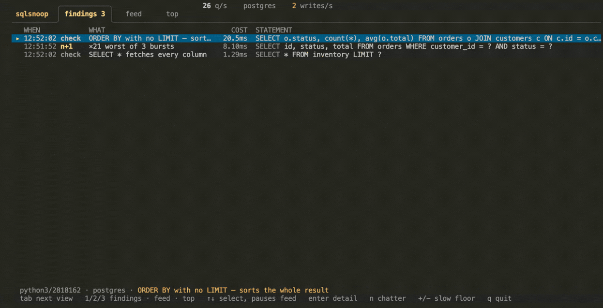
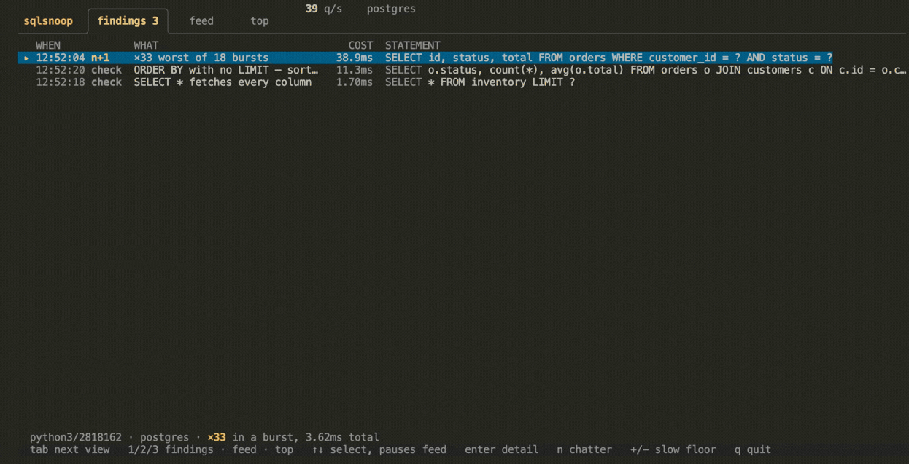
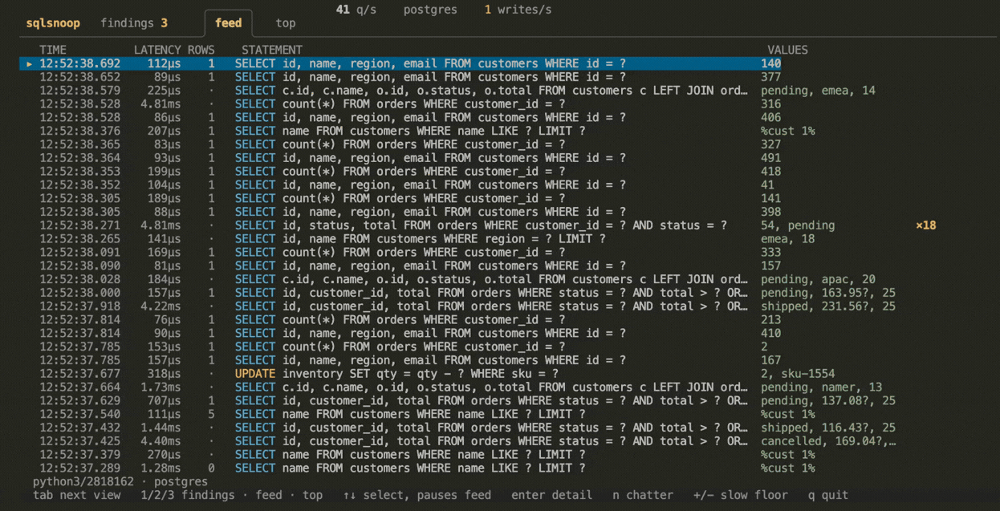
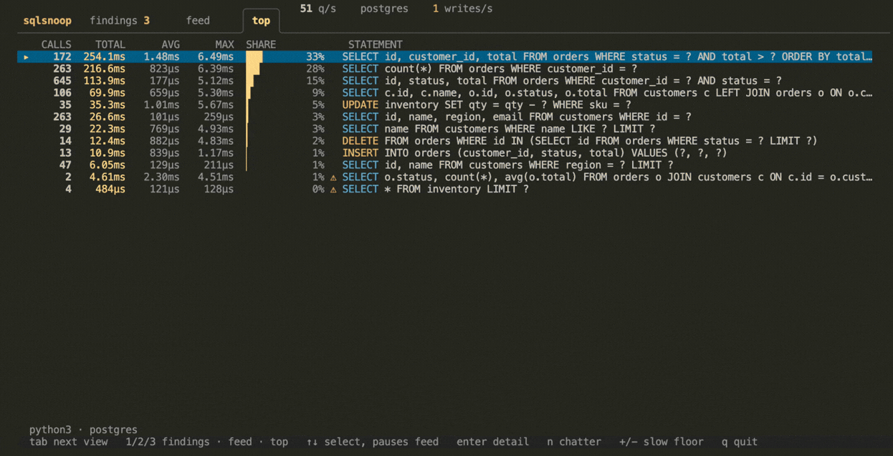

<!-- yeet:user-friendly-title: Find the slow queries your app really sent -->
# `sqlsnoop`

> **`EXPLAIN ANALYZE` for the queries your app actually sent.** Including the two hundred your ORM emitted without telling you.

<p align="center">
  <a href="#requirements"></a>
  <a href="https://yeet.cx/docs/?utm_source=github&utm_medium=readme&utm_campaign=sqlsnoop&utm_content=badge"></a>
  <a href="#the-bpf-side"></a>
  <a href="#supported-databases"></a>
  <a href="LICENSE"></a>
  <a href="https://discord.gg/JxVseaAVAU"></a>
</p>

<p align="center">
  
</p>

**`sqlsnoop` is an eBPF SQL statement monitor for Linux: it reads every statement your application sends Postgres or MySQL off the socket, with the parameter values the driver actually bound, and opens on a ranked list of the ones worth looking at.**

## Quick start

```sh
curl -fsSL https://yeet.cx | sh    # install yeet, once
yeet run gh:yeet-src/sqlsnoop     # clone, build and run in one step
```

An N+1 query is the bug this exists to find, and it is invisible to almost everything else. Each of the two hundred lookups is fast and correctly indexed, so a slow-query log stays empty and an APM shows you a slow endpoint with nothing to blame. The queries only look wrong together, and "together" is a thing you can see on the wire and nowhere else.

Where you would otherwise set `log_statement = 'all'` and restart, enable `pg_stat_statements` on a database you may not own, or bisect an ORM until it confesses what it generated, this attaches to the socket. One run watches every Postgres and MySQL client on the host, nothing is installed in the application, and the database is never asked for anything.

> [!TIP]
> **It attaches to the socket, not to the database.** That is what makes it work on a managed instance you cannot reconfigure, and it is why the parameter values are real: `tcp_sendmsg` sees the bytes the driver wrote, so `customer_id = 4471` is an observation rather than a reconstruction. The count is also the finding rather than the latency. In the recording above no statement is slow (the N+1's executions run about 180µs each); what makes it the most expensive thing on the box is that there are 333 of them.

## Contents

**Run it** — [Get started](#get-started) · [Have an agent set it up](#have-an-agent-set-it-up) · [Reading it without a TTY](#reading-it-without-a-tty)
**Understand it** — [A 60-second primer on prepared statements](#a-60-second-primer-on-prepared-statements) · [Questions this tool answers](#questions-this-tool-answers) · [What you're looking at](#what-youre-looking-at) · [Navigation](#navigation)
**Reference** — [Supported databases](#supported-databases) · [Requirements](#requirements) · [What it can't see](#what-it-cant-see) · [FAQ](#faq)
**Contribute** — [How it works](#how-it-works) · [Building from source](#building-from-source) · [Testing across kernels](#testing-across-kernels) · [Try it without real traffic](#try-it-without-real-traffic)

## Get started

```sh
curl -fsSL https://yeet.cx | sh
make            # clang + bpftool → bin/probe.bpf.o ; esbuild → the JS bundle
yeet run .      # watch every Postgres and MySQL client on the host
```
[Manual install guide](https://yeet.cx/docs/manual-installation?utm_source=github&utm_medium=readme&utm_campaign=sqlsnoop) | Linux only

No flags, no configuration, and nothing asked of the database. It watches every client on the machine at once, and none of them know.

Encrypted connections need a target for the TLS probes, passed after `--` so the flag reaches the script rather than `yeet` itself:

```sh
yeet run . -- --tls-binary libssl.so             # every dynamically-linked client
yeet run . -- --tls-binary "$(command -v node)"  # a runtime that bundles its own TLS
yeet run . -- --tls-binary auto                  # find a running client and use it
```

It runs until you `Ctrl-C`, reflows on resize, and needs a real terminal. Piping it prints an explanation and exits rather than failing obscurely; see [Reading it without a TTY](#reading-it-without-a-tty).

> [!IMPORTANT]
> **Start it before your workload.** The probes see traffic that happens while they are attached, and a uprobe only fires for processes that start afterwards. A client already running when you attach is invisible on the TLS path until it reconnects.

## Have an agent set it up

```
Set up sqlsnoop, a yeet script that shows every SQL statement an app sends.

1. git clone https://github.com/yeet-src/sqlsnoop && cd sqlsnoop
   (or: cd into an existing clone and `git pull`)
2. Read AGENTS.md for the runtime API and the gotcha list.
3. Run `make`. It fetches its own clang/bpftool/esbuild; no system toolchain.
4. Run the unit suite, which needs no kernel and no database:
     node --test test/lib.test.mjs
5. Verify the probe attaches and decodes, BEFORE touching the TUI:
     yeet run src/probes/sql.js
   Then, in another shell, send a query over TCP (not a Unix socket):
     psql -h 127.0.0.1 -U postgres -c 'select 1'
   You should see a [QUERY] line with the statement and a [REPLY] with a latency.
6. Run the real thing with traffic under it:
     yeet run .            # terminal 1
     demo/native.sh        # terminal 2

Two platform traps. This is Linux-only and needs a BTF-capable kernel; on
macOS use a Lima VM. And the probes hook tcp_sendmsg, so a client connected
over a Unix socket is invisible, so always connect to 127.0.0.1 when testing.

"It compiled" is not "it works". Step 5 is what proves bytes are arriving.
```

Prefer to drive it yourself? [Get started](#get-started) is the three-line version.

## A 60-second primer on prepared statements

Your application almost never sends a finished SQL string. It sends a template and, in a **separate wire message**, the values for the holes:

```
Parse:  SELECT id, total FROM orders WHERE customer_id = $1 AND status = $2
Bind:   $1 = 4471   $2 = 'pending'
```

That split is why the database can plan a query once and reuse it, and it is what makes SQL injection impossible. It is also the central problem for anything reading the wire: the statement and its values arrive separately, and they have to be stitched back together.

It gets harder. A client **prepares once and executes many times**, so the overwhelming majority of executions carry no statement text at all, just values. Measured against a real psycopg3 workload issuing 84 lookups: 36 statements on the wire and 99 parameter blocks. Those 63 unattributed executions *are* the N+1, which means a tool that expects one statement per execution cannot see the thing it exists to find. `sqlsnoop` keeps a per-socket registry of prepared statements and attributes each execution back through the statement name the protocol puts in the Bind message.

Two things follow, and both shape what you see. Parameter values are real observations rather than reconstructions, so `customer_id = 4471` is what the driver actually sent. And the tool can tell a **loop over rows** (the ids differ) from a **repeated identical query** (they don't), which are different bugs with different fixes.

## Questions this tool answers

**A page in my app takes three seconds and the slow-query log is empty. Where is the time going?**
Almost certainly an N+1: one request firing dozens of individually fast queries. Open `sqlsnoop`, load the page, and read the [findings view](#what-youre-looking-at). A burst of one shape appears as a single row reading `×33 worst of 9 bursts` with the total time it cost. No individual query is slow enough for a slow-query log to notice, which is exactly why the log is empty.

**My ORM generates the SQL and I have no idea what it actually sends. How do I see it?**
Run this and use your app. Every statement appears as the driver sent it, including the parameter values, with no `log_statement` to enable, no ORM echo flag, and no redeploy. Press `enter` on any row for the full statement with its values substituted, ready to paste into `psql`.

**How can I tell whether my N+1 fix actually worked?**
Watch the same request before and after in the [aggregate view](#what-youre-looking-at). The call count for that shape is the number that has to move: 200 becoming 2 is the fix landing, and a total time that barely changes means you moved the work rather than removing it.

**Can I see queries against a managed database like RDS or Cloud SQL, where I can't enable anything server-side?**
Yes, and this is the case it suits best. Everything happens on the client host, so there is no parameter group to change, no extension to install, and no restart. Note that a managed endpoint almost always means TLS, so you need `--tls-binary`; and if your client is Go or Java, [what it can't see](#what-it-cant-see) applies.

**A migration is about to run against production and I want to watch what it does. Is that safe?**
It is read-only: the probes copy bytes and never modify, delay, or block anything. Run `sqlsnoop` on the host, then run the migration. A `DELETE` or `UPDATE` with no `WHERE` clause is flagged the moment it goes out, which is sooner than you would find out from the row count.

**Which of my services is hammering this table?**
The aggregate view ranks statement shapes by total database time and names the client process for each. That process attribution is the part a server-side view structurally cannot give you: `pg_stat_statements` knows the query but not who sent it, because by the time the server sees it the client is just a connection.

**How do I split application time from database time on a slow endpoint?**
Compare the round-trip latency here against what your app reports. If the statement took 2ms on the wire and your handler took 400ms, the other 398ms is yours: serialization, N+1 overhead in the ORM, or work that has nothing to do with the database. Read the latency as socket-paired rather than exact; the [FAQ](#faq) explains what that means.

**Is this a replacement for Datadog, pganalyze, or `pg_stat_statements`?**
No, and not close. Those retain history, aggregate across a fleet, alert, and let you query last Tuesday. `sqlsnoop` is one host, an in-memory log of the last 2,000 statements, and nothing kept after you quit. What it gives you that they don't is the *client* side: which process, which values, and the individual executions of a burst rather than a total. Use it to find a bug, then use them to know whether it is still gone next month.

**When should I use this instead of `pg_stat_statements`, `auto_explain`, or `tcpdump`?**
Reach for `pg_stat_statements` for a server-wide, historical picture across every client. It is the right tool for "what is expensive on this database" and it survives restarts. Reach for `auto_explain` when you need the query *plan*, which this cannot see at all. Reach for `tcpdump` when you need the bytes rather than the statements. Reach for `sqlsnoop` when the question involves the client: what did *this* app send, with *what* values, and how many times for *one* request. For MongoDB the sibling is [`mongosnoop`](https://github.com/yeet-src/mongosnoop); for Redis, [`redissnoop`](https://github.com/yeet-src/redissnoop); for SQLite, which is a library rather than a server and needs a completely different seam, [`sqlitefeed`](https://github.com/yeet-src/sqlitefeed).

## What you're looking at

`tab` cycles them; `1`, `2` and `3` jump directly. The active view is drawn as a folder tab attached to the panel below it.

### findings, or what the tool noticed

<p align="center">
  
</p>

This opens first, and that ordering is the design. A live feed at forty statements a second is twenty rows of routine lookups with one real problem somewhere in them, and finding it is work the tool should do rather than delegate to whoever is watching.

| column | meaning |
| --- | --- |
| `WHEN` | wall clock of the finding, so it lines up with your application log |
| type | `n+1`, `slow`, `check` (a property of the statement text) or `error` |
| `WHAT` | what was found, with its scale: `×33 worst of 9 bursts` |
| `COST` | total database time this finding accounts for; the ranking key |
| `STATEMENT` | the shape it was found on |

Ranked by measured cost, with no severity scale. "High" and "medium" would be judgments the wire cannot support; total time is a number. Errors are the one exception, pinned above the ranking, because an error reply has no latency to sort by and is the most actionable thing on the list.

<details>
<summary>What qualifies as a finding, and the thresholds behind each</summary>

Four kinds, all read off the captured statements with no guessing about the server:

**`n+1`** — one shape repeated at least ten times, from **one thread**, within a tight window. Both guards exist because of false positives found in testing: with four concurrent connections, ten executions of a common lookup land adjacent in the log purely by chance, and an early version reported `SELECT count(*)` and a primary-key lookup as N+1s alongside the real one. A real N+1 is a loop inside one request, so its executions share a thread and arrive in milliseconds. Bursts of the same shape collapse into one finding: six bursts is one bug that happened six times, and reporting each separately produced 24 rows where there were three problems.

**`slow`** — an execution at least 20× that **same shape's own median** and at least 50ms absolute. Comparing a shape against itself is the only threshold that generalises: 40ms is unremarkable for a heavy aggregate and alarming for a primary-key lookup, so a global "slower than X" either floods or stays silent depending on the workload. Both conditions are needed. At 8× and 5ms this fired on ordinary VM jitter and produced ten near-identical rows that buried the real findings.

**`check`** — a property of the statement text: a write with no `WHERE`, `SELECT *`, `ORDER BY` with no `LIMIT`, a leading-wildcard `LIKE`, a comma join with no predicate, `NOT IN (SELECT …)`, a function wrapped around a column in a predicate. Deliberately **not** included: anything about indexes or query plans. Those are invisible from the wire, and claiming them is what makes an engineer stop believing the flags that are sound.

**`error`** — the server replied with an error.

An empty findings list says what it looked at (`1,284 statements seen, no N+1 bursts, no errors`) rather than rendering blank, because a blank pane reads as a broken tool where a stated result reads as a clean bill of health.

</details>

### feed, or every statement as it happened

<p align="center">
  
</p>

Strictly one line per statement, which is the constraint the whole layout follows from. An earlier version spent up to three lines on a row (one for the statement, one for its values, one for a warning), and with rows one to three lines tall the eye cannot establish a rhythm, so it re-reads every row instead of scanning a column.

| column | meaning |
| --- | --- |
| `TIME` | wall clock to the millisecond |
| `LATENCY` | socket-paired round trip; `—` when no reply was matched |
| `ROWS` | rows the reply reported; `·` when it didn't say |
| ⚠ / ✗ | a statement-level check, or an error reply |
| `STATEMENT` | the normalized shape, verb coloured by read vs write |
| `VALUES` | what the driver bound, positionally |
| `×N` | a repeated shape, folded, with its burst count |

Selecting a row **pauses** the feed and the header says so, with a count of what is buffering. Nothing is dropped; the capture keeps running and the view holds still so it can be read. Without this, "row 4" is a different statement every 250ms and the detail pane describes a moving target.

### top, or ranked by total time

<p align="center">
  
</p>

The same traffic collapsed by shape. A `pg_stat_statements` nobody had to enable, that also knows which process sent each one.

```
    CALLS    TOTAL      AVG      MAX  SHARE        STATEMENT
 ▸    167  204.8ms   1.23ms   8.89ms  ███     37%   SELECT count(*) FROM orders WHERE customer_id = ?
      110  159.1ms   1.45ms   8.02ms  ██▍     29%   SELECT id, customer_id, total FROM orders WHERE status = ? AND total > ?…
      333   61.0ms    183µs   5.74ms  ▉       11%   SELECT id, status, total FROM orders WHERE customer_id = ? AND status = ?
       20   23.9ms   1.20ms   6.86ms  ▍        4% ⚠ SELECT o.status, count(*), avg(o.total) FROM orders o JOIN customers c ON…
       16   19.0ms   1.19ms   6.50ms  ▍        3%   UPDATE inventory SET qty = qty - ? WHERE sku = ?
```

Sorted by `TOTAL`, not average or max, because a 183µs query run 333 times costs more than a 6ms one run twenty times and the total is the only column that says so. The share bar lives here and deliberately not in the feed: these rows are sorted by cost, so the bars descend monotonically and read as one shape, where in a time-ordered feed identical bars zigzag into noise.

### The detail pane

`enter` on any row in any view. For a folded burst it leads with the **executions**, which is the diagnosis:

```
  29 executions  5.79ms total
    11:47:40.717 1, pending      100µs
    11:47:40.717 4, pending      162µs
    11:47:40.718 7, pending      107µs
    11:47:40.718 10, pending     100µs
    … 22 more retained

  statement
    SELECT id, status, total FROM orders WHERE customer_id = 34 AND status = 'pending'
    values substituted — ready to paste into psql or EXPLAIN
```

Customer ids 1, 4, 7, 10 a millisecond apart is a loop over rows. The same id 29 times would be a cache that isn't working. `×29` alone cannot tell you which, and that distinction is the whole reason this pane exists.

The runnable statement is built only when every value decoded with certainty. Where a value is ambiguous the pane shows the template and the parameters separately instead, because SQL that looks runnable but carries a mis-decoded value either fails with a type error or, much worse, runs against the wrong row.

## Navigation

| key | action |
| --- | --- |
| `tab` | next view |
| `1` `2` `3` | findings · feed · top |
| `↑` `↓` or `k` `j` | move the selection (pauses the feed) |
| `g` or `Home` | back to the newest row, resuming the feed |
| `enter` | open or close the detail pane |
| `n` | show or hide session chatter |
| `+` `-` | raise or lower the slow-statement floor, patched live into the kernel |
| `q` | quit |
| `Esc` | close the detail pane, then resume the feed, then quit |

**Session chatter** is what the driver sends on its own: `BEGIN`, `COMMIT`, `SET`, `SELECT 1` health checks, `information_schema` lookups. It is hidden by default because volume makes it useless. A pool of twenty connections health-checking every second sends 1,200 `SELECT 1`s a minute against maybe fifty real queries. It is filtered rather than dropped, because a `ROLLBACK` storm means transactions are failing and `BEGIN`/`COMMIT` around a single `SELECT` means your ORM opens a transaction per read.

## Reading it without a TTY

A TUI is unreadable to an agent, a CI job, or a pipe. The data layer runs standalone and streams plain text:

```sh
yeet run src/probes/sql.js
```

It prints every statement, every parameter block and every reply as separate lines, which also makes it the right way to *see* the stitching problem rather than read about it. This is the path to use for verifying the probe works, and `yeet run .` will tell you to use it if you pipe the TUI.

## How it works

Three layers, dependencies pointing downward. `src/probes/` is the only BPF-aware code and exposes plain signals; `src/components/` is pure presentation and never sees BPF; `src/lib/` is pure logic with no I/O, which is why the analysis has a unit suite that needs no kernel.

```
src/bpf/sql.bpf.c      socket kprobes + TLS uprobes; frames both wire protocols
src/probes/sql.js      loads the object, stitches statements to values to replies
src/lib/normalize.js   statement → shape; verb, tables, chatter classification
src/lib/params.js      Postgres Bind and MySQL COM_STMT_EXECUTE decoders
src/lib/findings.js    N+1 detection, slow-outlier detection, the ranking
src/lib/footguns.js    the statement-level checks
src/lib/fold.js        burst folding, shared by the feed and the detail pane
src/lib/format.js      pure text helpers (no runtime import, so it is testable)
src/lib/theme.js       the palette and the colour decisions
src/components/*.jsx   tabs, findings, feed, top, detail, context, footer
```

### The BPF side

| program | hook | what it captures |
| --- | --- | --- |
| `on_sendmsg` | `kprobe/tcp_sendmsg` | an outgoing write: frames it, lifts the statement or the parameter block |
| `on_recvmsg` / `_ret` | `kprobe` + `kretprobe/tcp_recvmsg` | where the reply will land, then the reply itself and its latency |
| `on_ssl_write` | `uprobe/SSL_write` | the same, read inside TLS before encryption |
| `on_ssl_read` / `_ret` | `uprobe` + `uretprobe/SSL_read` | the plaintext reply inside TLS |

Seven maps. `sql_events` is a 512 KiB `RINGBUF`. `inflight` is an `LRU_HASH` keyed on `(pid, socket)` whose value is a **ring of send timestamps** rather than a single slot. Clients do not wait for a reply before sending the next statement, and with one slot 120 of 135 replies had no timestamp to pair against and were dropped in the kernel. The rest are `PERCPU_ARRAY` scratch, because a `sql_event` carrying a 256-byte statement window is far past the 512-byte BPF stack limit.

> [!NOTE]
> **The BPF program declares `Dual BSD/GPL`, and that is a functional requirement rather than a formality.** It calls `bpf_probe_read_user`, which the kernel marks GPL-only, so a program declaring plain `BSD` is rejected at load with `cannot call GPL-restricted function from non-GPL compatible program`. The declaration in `SEC("license")` covers the eBPF object; the repository is Apache-2.0.

**The kernel stays dumb**, and this is the load-bearing design decision. It decides "is this a SQL frame, and where does the text start", copies a fixed window, and stops. It does not tokenize SQL, normalize a statement, or decode a binary parameter, because those are unbounded walks over variable-length data: exactly what the verifier rejects and exactly what JavaScript does well.

<details>
<summary>Three verifier walls, and what each one forced</summary>

Every one of these presented as a mysterious rejection rather than a compile error.

**A loop with a runtime-dependent exit is not generalised.** `for (i…) { if (i >= end) break; }` looks bounded, but because `end` is an unknown scalar the verifier walks every iteration as a distinct state: 256 iterations became 256 states per call site, half a megabyte of verifier log, and a rejection. The fix is a **constant-trip loop with a masked index** (`buf[i & (SNIFF_LEN - 1)]`, with `SNIFF_LEN` a power of two) that copies the full window unconditionally and lets userspace trim it. Copying some bytes past the end of a frame is the price of a program that loads.

**Unrolling a big copy loop overruns the jump range.** `#pragma unroll` on the copy helpers, inlined once per protocol frame, produced `fatal error: Branch target out of insn range` from clang before the verifier ever saw it. Making them `__noinline` so they exist once fixed it.

**A BPF global function takes at most five register arguments.** Six gives "too many arguments / stack arguments are not supported". The per-frame handler packs its bounds into a struct pointer instead.

There is a fourth, smaller one: scanning a variable-length cstring belongs in userspace. A 64-iteration masked scan for the prepared-statement name *did* verify, but unrolled to roughly 1,700 instructions and pushed the object over the complexity budget, so the window is copied name-and-all and JavaScript splits on the NUL.

</details>

### Why the frame loop stops at four

Postgres pipelines several messages into one write, so the parser walks frames rather than assuming one message per write. The loop is bounded at **four**, and that number is a verifier budget rather than a protocol limit: each iteration inlines a 256-byte copy, so the frame count multiplies straight into complexity. At six frames `on_sendmsg` verified at 686,652 instructions, 69% of the 1,000,000 ceiling, with an older kernel's verifier exploring more states for the same code. Four halves it to 345,443 and still reaches the Parse and the Bind, which are the only frames the parser reads.

## Building from source

```sh
make            # both compilers: BPF object + JS bundle
make veristat   # load every program through the verifier on this kernel
make clean
```

`make` runs two independent toolchains. clang and bpftool compile `src/bpf/sql.bpf.c` into `bin/probe.bpf.o`; esbuild bundles `src/main.jsx` into `src/index.jsx` with the `yeet:*` builtins left external. Both come from a checksum-pinned toolchain fetched into a per-machine cache, so the build needs no system clang and no Node or npm. `bin/probe.bpf.o`, `src/index.jsx` and `.build/` are generated, and `make clean` removes the bundle, so a bare `make` is required before `yeet run .` will start after a clean.

> [!NOTE]
> Run `make veristat` with `sudo`. Unprivileged, it reports every program as `failure` with zero instructions and an empty log, which is `-EPERM` from the loading probe rather than a verifier rejection. It is a convincing false alarm.

The `@/` alias is bundle-time only, resolved by esbuild through the tsconfig `paths`, which is why `src/lib/` imports its siblings by relative path: a module reached through the alias cannot be loaded by Node, and that made the analysis untestable. `yeet run src/main.jsx` fails for the same reason; run `yeet run .`.

## Testing across kernels

Two suites, and neither needs the other.

```sh
node --test test/lib.test.mjs   # 43 tests, no kernel, no database
make veristat                   # every BPF program through this kernel's verifier
```

The unit suite covers normalization, both parameter decoders, the footgun checks, findings derivation and formatting. It exists because CI runs the verifier only, which left every line of the analysis uncovered, and the analysis is where the bugs have been. It caught two on its first run: `verbOf` classified `WITH x AS (…) DELETE FROM t` as a *read*, so a CTE-wrapped delete was never counted as a write and never checked for a missing `WHERE`; and the leading-wildcard `LIKE` check could never fire, because its condition reduced to a test of the normalized shape where the `%` it looks for has already been replaced.

[`.github/workflows/kernel-matrix.yml`](.github/workflows/kernel-matrix.yml) builds the object and boots kernels 6.1, 6.6, 6.12 and bpf-next in a VM, failing if any verifier rejects a program.

## Try it without real traffic

```sh
demo/native.sh       # drives a Postgres already installed on this host
demo/run.sh          # starts a throwaway postgres:16 container, then drives it
demo/mysql-run.sh    # the same for mysql:8
```

Each seeds a small shop schema and runs a workload shaped like an application rather than a loop: four concurrent connections picking from eight weighted endpoints with jittered think time, reads outnumbering writes about fifteen to one, and an N+1 firing on roughly one request in fourteen so it stands out against normal traffic instead of being the baseline.

That shaping is not cosmetic. An earlier version ran the same five statements in the same order every 500ms, and besides looking obviously synthetic it *hid two real capture bugs*: a `numeric` parameter rendering as the raw bits of its float, and an inventory write's value captioning an orders lookup. Both appeared within seconds of the traffic becoming concurrent.

> [!IMPORTANT]
> The demos connect over `127.0.0.1` deliberately. The probes hook `tcp_sendmsg`, so a client on a Unix socket is invisible, and that is the most common reason a first run shows an empty screen.

## Supported databases

| database | plaintext | inside TLS | parameter values |
| --- | --- | --- | --- |
| PostgreSQL | yes | yes, with `--tls-binary` | yes, from the Bind message |
| MySQL / MariaDB | yes | yes, with `--tls-binary` | yes, from `COM_STMT_EXECUTE` |

Both simple queries and the extended/prepared protocols are read. Verified against PostgreSQL 17 and MySQL 8 with psycopg2, psycopg3, MySQLdb and the `psql` and `mysql` command-line clients.

## Requirements

> [!IMPORTANT]
> - **A Linux kernel with BTF** (`CONFIG_DEBUG_INFO_BTF=y`) for CO-RE, which `bpftool` reads to generate `src/bpf/include/vmlinux.h`. Verified on 6.1, 6.6, 6.12 and bpf-next; CO-RE means no per-kernel recompile.
> - **Bounded loop support**, kernel 5.3 and later. The parsers depend on it.
> - **A real terminal.** The TUI needs a TTY; the probe module is the pipeable path.
> - **The yeet daemon**, which handles the privileged load. `yeet run` is not run with `sudo`.

Reading inside TLS additionally needs a library exposing `SSL_write`/`SSL_read` by name, which covers OpenSSL and BoringSSL.

## What it can't see

> [!NOTE]
> `sqlsnoop` is observability, not enforcement. It reads bytes and never modifies, delays, or blocks a statement. It also never claims anything about the query *plan*: whether an index was used is invisible from the wire, and `EXPLAIN` still owns that question.

- **Go and Java clients over TLS.** Go's `crypto/tls` is pure Go and Java's JSSE lives inside the JVM, so neither exposes a C symbol to hook. Plaintext connections from both are read normally. This is the sharpest limit here, and it is unavoidable rather than unimplemented.
- **Clients on a Unix socket.** The probes hook `tcp_sendmsg`. A local client connected through `/var/run/postgresql/.s.PGSQL.5432` is invisible; connect over TCP.
- **Statements past 256 bytes**, and parameter blocks past 192. The kernel copies a fixed window and marks the record truncated, so a long statement shows its opening: enough to identify it, not enough to read it whole.
- **Exact latency under pipelining.** Neither protocol carries a request id, so a reply is paired with the oldest outstanding send on its socket. That is correct for the ordered request/response cycle every SQL client uses, and it would be defeated by a genuinely concurrent multiplexer over one connection. The UI labels it socket-paired rather than presenting it as exact.
- **Row counts on large results.** Postgres states its count after the data rows, so on a big result it falls past the captured window. Those show `·` rather than a guessed zero.
- **A value it could not decode with certainty.** Eight bytes on the wire could be an `int8`, a `float8` or a timestamp, and the Bind message does not carry the type. Ambiguous values are marked, and the runnable-statement form refuses to build rather than handing you SQL that runs against the wrong row.
- **Anything after you quit.** 2,000 statements in memory, one host, no retention, no alerting, no aggregation across machines.
- **Databases other than Postgres and MySQL.** For MongoDB see [`mongosnoop`](https://github.com/yeet-src/mongosnoop), for Redis [`redissnoop`](https://github.com/yeet-src/redissnoop), for SQLite [`sqlitefeed`](https://github.com/yeet-src/sqlitefeed).

## FAQ

**Why is the screen empty?**
Three causes, in the order they actually happen. Your client is on a Unix socket rather than TCP, so `tcp_sendmsg` never sees it. Your workload started before the probes attached. Or your connections are encrypted and you have not passed `--tls-binary`. If the header shows a rate but the findings view is empty, that is a result rather than a failure: it says how many statements it looked at and found nothing worth flagging.

**Does it slow down my database or my application?**
The in-kernel check runs before anything is copied: a write that is not a recognisable SQL frame costs a length comparison and a return. Cost tracks matched statements rather than total socket traffic, and nothing is added to the application or the database. The kernel also holds a slow-statement floor you can raise live with `+`, which filters before the ring buffer rather than after.

**Why does the latency say `—`?**
No reply was paired with that statement. It happens when a statement was still outstanding as the tool started, when a client pipelines further ahead than the sixteen-deep per-socket ring, or when a connection dropped mid-statement. The statement was really sent; only its timing is unknown, which is why it shows a dash rather than a zero.

**Can I run it in a container, or against a database in one?**
Yes to both, with the usual eBPF caveat: the probe needs to see the host kernel, so run `sqlsnoop` on the host (or a privileged container with `/sys` and the BPF filesystem) rather than inside the application's container. It then sees every client on the machine, containerised or not, because it hooks the kernel rather than a network namespace.

**Why is one query showing up as two rows?**
The shapes differ somewhere you have not noticed: a different column list, an extra predicate, an `ORDER BY` on one path. Press `enter` on each to see the full statement text. The normalizer collapses literals, `IN` lists and multi-row `VALUES` clauses, but it deliberately does not collapse structural differences, because two statements that touch different columns are two queries.

## License

Apache-2.0.

---

Built with [yeet](https://yeet.cx/docs/?utm_source=github&utm_medium=readme&utm_campaign=sqlsnoop&utm_content=footer), a JS runtime for writing eBPF programs on Linux machines. Join us on [discord](https://discord.gg/JxVseaAVAU).
